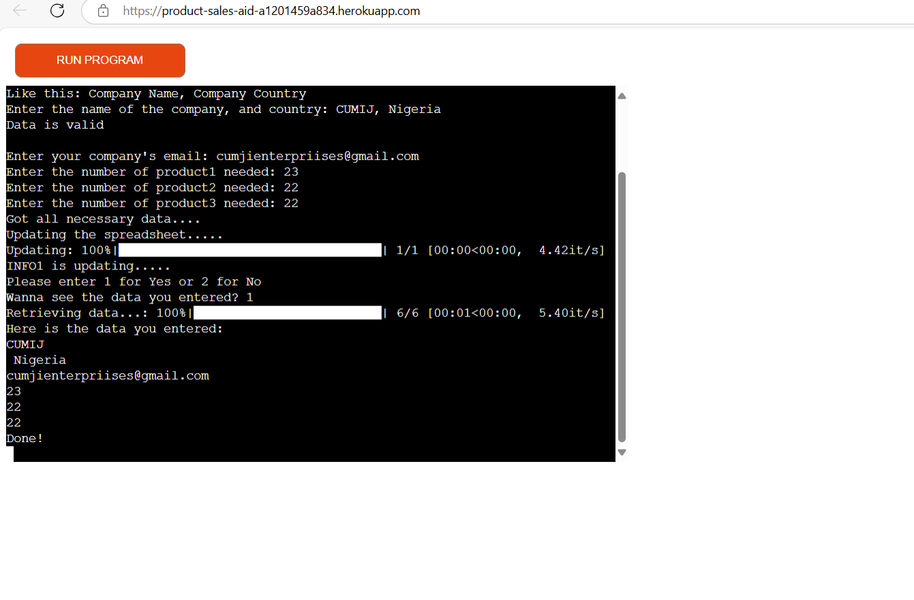
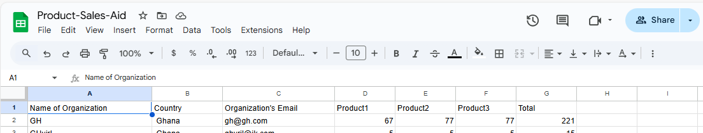
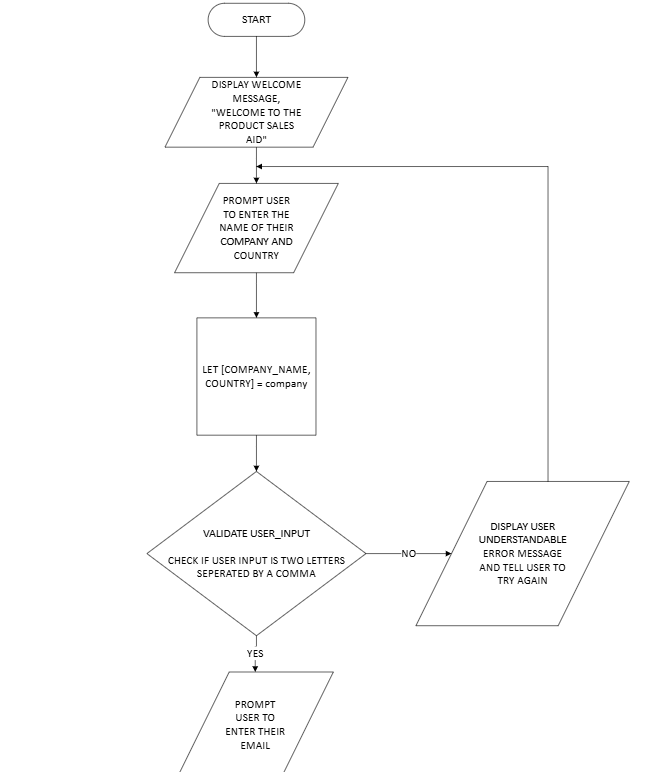
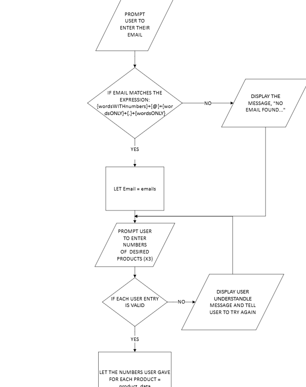
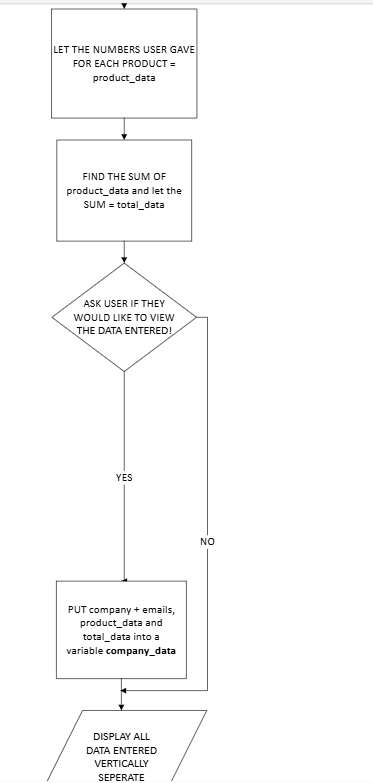
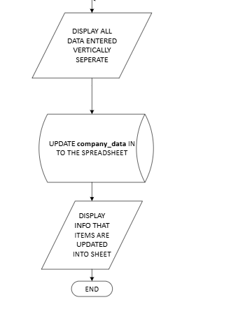
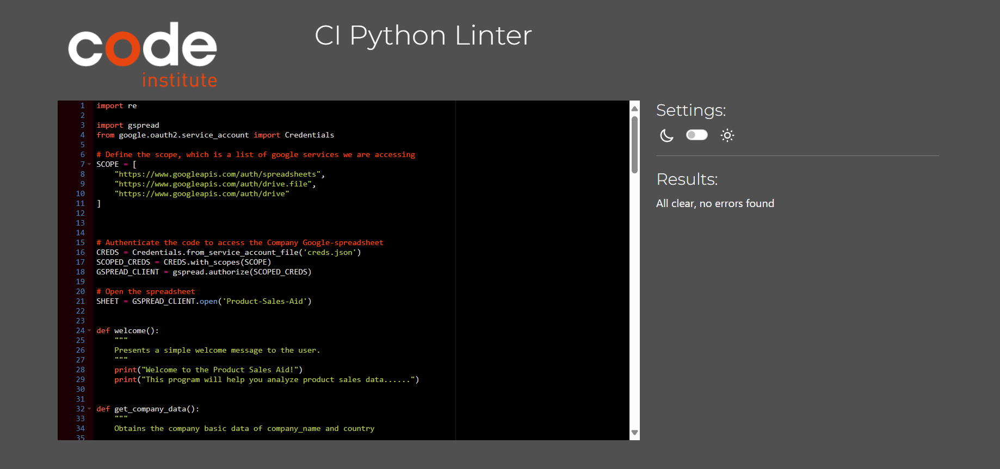
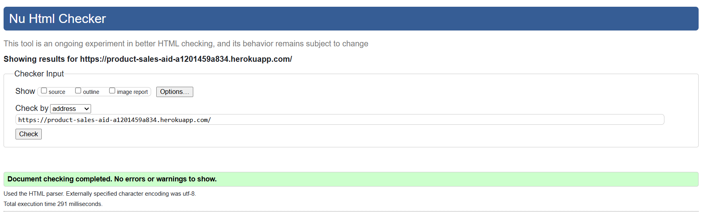

# [Uche&#39;s PAS](https://product-sales-aid-a1201459a834.herokuapp.com/)

- A company, Uche's Product Sales Company[imaginative] uses this software to automate having a spreadsheet of the details they need from their customers when their customers want to make a purchase of certain products.
- Uche's PAS(Product Sales Aid) is a Command-Line Interface website itinerary used to register a company's details along with an amount of products they want.

## Table of Contents

Click here for Table of Contents

[Mock-up Screenshots](#mockup-screenshots)

[User goals](#user-goals)

- [Pre-development](#pre-development)

[Testing](#testing)

- [Future Updates](#future-updates)
- [Validation](#validation)
- [Deployment](#deployment)

[Deployment](#deployment)

- [Heroku](#heroku)

  - [Cloning](#cloning)
  - [Forking](#forking)

[Credits](#credits)

- [Content and Code](#content-and-code)
- [Acknowledgments](#acknowledgements)

## Mockup-screenshots

### User goals:

Get clear instructions on how to use the system in front of them that they can refer to if needed. The ability to input their details including company name, county, email(optional), and some product numbers. Get a sum of the numeric data. Ability to retrieve the sent data.
Receive a copy of the information inputted via email(Future Plan).

### Site-owner-goals

Provide a program that is easy to use and maintain. Present a program that gives clear instructions each time a client visits. Develop a program that can have updated features added at a later time. Add the submitted information to Google Sheets with one sheet for information.

### Pre-development

I created a flow chart. All I had to do then is follow the flowchart and I set up projects in GitHub to write out work that needed to be done. The aim is to provide early and continuous delivery of the project.

<object data="documentation/flowchartPSA.pdf" type="application/pdf" width="100%" height="600px"></object>

Your browser doesn't support pdfs. <a href="documentation/flowchartPSA.pdf">Get it here! To see the flowchart</a>

- Here are simple screenshots of the flowchart
  
  
  
  

## Tools & Technologies Used

- [Heroku](https://dashboard.heroku.com/apps) used for hosting the deployed front-end & back-end site.
- [Git](https://git-scm.com) used for version control. (`git add`, `git commit`, `git push`)
- [GitHub](https://github.com) used for secure online code storage.
- [GitPod&#39;s Workspace](https://codeinstitute-ide.net/workspaces) used to manage and run the development workspace for the Product Sales Aid project seamlessly.
- [Google Sheets](https://docs.google.com/spreadsheets/d/1QKMGuemIVcsDW5-9jmrrAfPrRtCDpV8x_o3t4_soqMk/edit?gid=0#gid=0) used to store user inputted data and will be the sheet the Uche Company uses to view their customer orders.
- [PEP8 CI Linter](https://pep8ci.herokuapp.com/#) used to do checks for errors on my Python Code.
- [Microsoft Visio](https://www.microsoft365.com/launch/Visio/?auth=2&home=1) used as flowchart making tool to make the steps the application would take.
- [VSCode](https://code.visualstudio.com/) used for local IDE for development. It possessed extensions which helped me immensely during my making of the site.
- [MS Copilot]() was used to help me understand the errors brought out in the PEP8 Linter from CI and I used it as a tool to help me better understand the meaning of those errors and how to face them such as the E128 continuation line under-indented for visual indent. It was used as a tool to also aid me better understand the "gspread" and "google-auth" packages as looking at documentation was very uncanny.
- [W3C HTML Validator](https://validator.w3.org/) used to do checks for errors on HTML elements of the official website.

## Python Libraries and Packages Used

- gspread to access Google spreadsheet.
- re(Regular Expression) to check email expression and check if it matches expression given.
- google-auth used to confirm authorizations between python code and APIs for google services.
- tqdm used to display progression bars as it creates loading bars to showcase updates and downloads.

## Testing

The portal has been well tested and the results can be viewed here.

### Future Updates

- The ability to actually send automated emails of receipts to the given email addresses.
- The ability to let users give the name of the product needed from us
- Improve the UI of the CLI site

### Validation

PEP8 - Python style guide checker imported - https://pypi.org/project/pep8/
All code validated and where lines were showing as too long they were adjust which was fixed by adjusting code to where they need to be.
There are no issues to report from the linter of PEP8

It also passed through the W3C HTML Validator without any errors:

### Bugs

It is important to note that during the early stages of development I fell into some logical errors such as misuse of a while loop and I fixed that error by putting the conditions in their right indented place.

Before there were no issues, PEP8 Linter hinted about lines that were too long and space characters it detected; I fixed the errors by noting where it detected spaces and removed such spaces.

Another error the linter formally wrote was the "continuation line under-indented for visual indent" which I fixed using help from using Microsoft Copilot to understand the meaning of the error as I couldn't get it by intuition and hence use the gained guidance of MS. Copilot to fix the issue; the same thing occured with the E302 Error of expected 2 blank lines, found(1) as I didn't know it meant the lines before a function but Ms.Copilot pointed that out.

With the current code there are ***NO*** issues to report.

## Deployment

The site was deployed to Heroku. The steps to deploy are as follows:

### Heroku

The Application has been deployed from GitHub to Heroku by following the steps:

- Create or log in to your account at heroku.com
- Create a new app, add a unique app name and then choose your region from Europe or America.
- Click on create app
- Go to "Settings"
- Under Config Vars add the private API key information using key 'CRED' and into the value area copy the API key information added to the .json file. - Also add a key 'PORT' and value '8000'.
- Add required buildpacks (further dependencies). For this project, set it up so Python will be on top and Node.js on bottom
- Go to "Deploy" and select "GitHub" in "Deployment method"
- To connect Heroku app to your Github repository code enter your repository name, click 'Search' and then 'Connect' when it shows below.
- Choose the branch you want to build your app from
- If preferred, click on "Enable Automatic Deploys", which keeps the app up to date with your GitHub repository
- Wait for the app to build. Once ready you will see the “App was successfully deployed” message and a 'View' button to take you to your deployed link.
- Branching the GitHub Repository using GitHub Desktop and Visual Studio Code
- Go to the GitHub repository.
- Click on the branch button in the left hand side under the repository name.
- Give your branch a name.
- Go to the CODE area on the right and select "Open with GitHub Desktop".
- You will be asked if you want to clone the repository - say yes.
- GitHub desktop will suggest what to do next - select Open code using Visual Studio Code.
- The deployed project live link is HERE - Use Ctrl (Cmd) and click to open in a new window.

#### Cloning

- You can clone the repository by following these steps:

1. Go to the [GitHub repository](https://github.com/Uche05/ProductSalesAid).
2. Locate the Code button above the list of files and click it.
3. Select if you prefer to clone using HTTPS, SSH, or GitHub CLI and click the copy button to copy the URL to your clipboard.
4. Open Git Bash or Terminal.
5. Change the current working directory to the one where you want the cloned directory.
6. In your IDE Terminal, type the following command to clone my repository:
   - `git clone https://github.com/Uche05/ProductSalesAid.git`
7. Press Enter to create your local clone.

For Gitpod users, this was implemented on gitpod, it was from gitpod to an SSH Connection on my local PC directly to Github via git and some useful VSCode extensions.

#### Forking

By forking the GitHub Repository, we make a copy of the original repository on our GitHub account to view and/or make changes without affecting the original owner's repository.
You can fork this repository by using the following steps:

1. Log in to GitHub and locate the [GitHub Repository](https://github.com/Uche05/ProductSalesAid).
2. At the top of the Repository (not top of page) just above the "Settings" Button on the menu, locate the "Fork" Button.
3. Once clicked, you should now have a copy of the original repository in your own GitHub account.

## Credits

The following are credits to various people and technologies that have directly or otherwise assisted in the creation of the Uche's PAS(Product Sales Aid) site.

### Content and Code

| Source                                                  | Location                                                                                                    | Notes                                                                                                                                                                                                         |
| ------------------------------------------------------- | ----------------------------------------------------------------------------------------------------------- | ------------------------------------------------------------------------------------------------------------------------------------------------------------------------------------------------------------- |
| ***re***(Regular Expression)                    | Python Package used match the email expression | The re(Regular Expression was used to match the expression of an email to check if it followed the format of {word WITH number with symbols}{@}{word WITH number WITH symbols}{.}{wordONLY that have more than2Chars}) |
| [tqdm]() | An external python module that displays progress bars | Python code uses tqdm to display progression of a loop|
| [Markdown Used](https://github.com/boderg/your-weather)    | Markdown                                                                                                    | Markdown template was from the given[github repo](https://github.com/boderg/your-weather) for the both "README" and "TESTING" from [here](https://github.com/todiane/corri-construction-p3?tab=readme-ov-file)      |
| [Code snippets](https://github.com/Uche05/ProductSalesAid) | Certain Python Code Snippets for importing and use of gspread and google-auth and use of exception handlers | Python code in use of gspread and google-auth came from[LoveSandwiches Project](https://github.com/Uche05/love-sandwiches) taught officially by Code Institute.                                                  |
| [Code snippets](https://github.com/Uche05/ProductSalesAid) | Certain Python Code Snippets for importing and use of gspread and google-auth and use of exception handlers | Python code in use of gspread and google-auth came from[LoveSandwiches Project](https://github.com/Uche05/love-sandwiches) taught officially by Code Institute.                                                  |

### Acknowledgements

- I would like to thank my Code Institute mentor, [Jubril Akolade](https://github.com/Jubrillionaire) for his support throughout the development of this project.
- I would like to thank [Code Institute](https://codeinstitute.net) for giving me the opportunity to complete the P3 course.
- I would like to thank the [Code Institute](https://codeinstitute.net) facilitator team, [Iris Smok](https://github.com/Iris-Smok/Iris-Smok), [the Code Institute Student Care Team](studentcare@codeinstitute.net) and [Irene Neville](irene.neville@codeinstitute.net) for their advice.
- I would like to thank the [Code Institute Slack community](https://code-institute-room.slack.com) for the moral support and general information that helps with my studies with Code Institute.
- I would like to thank my family, for their support and understanding, for believing in me, and allowing me to make this transition into software development.
- I personally enjoyed performing this project as it was a chance to both construct and actually program using coding programming techniques and paradigms; to make a functional content myself.
- Written and edited by Uchechukwu Christian Kpadeuwa
